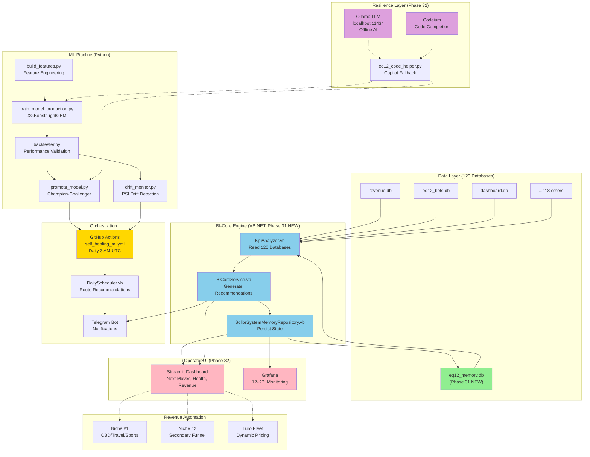

# 🏗️ EQ12 COMPLETE ARCHITECTURE (Phase 31-32)

## SYSTEM DIAGRAM (Mermaid)



---

## FILE ARCHITECTURE

```
EQ12_BROKEN_20251122_210342/
│
├── 📁 src/
│   ├── EQ12.Core/
│   ├── EQ12.Security/
│   ├── EQ12.Diagnostics/
│   ├── EQ12.TelegramBot/
│   ├── EQ12.StackAgent/
│   ├── EQ12.CommandCenter/
│   ├── EQ12.BICore/                          ← NEW (Phase 31)
│   │   ├── BiCoreService.vb
│   │   ├── KpiAnalyzer.vb
│   │   ├── KpiState.vb
│   │   ├── NextMoveRecommendation.vb
│   │   ├── SqliteSystemMemoryRepository.vb
│   │   └── EQ12.BICore.vbproj
│   └── EQ12.Diagnostics/
│
├── 📁 scripts/
│   ├── train_model_production.py             ← NEW (Phase 31)
│   ├── drift_monitor.py                      ← NEW (Phase 31)
│   ├── promote_model.py                      ← NEW (Phase 31)
│   ├── build_features.py                     ← Existing
│   ├── backtester.py                         ← Existing
│   ├── dashboard_api.py                      ← Phase 32 TODO
│   ├── eq12_code_helper.py                   ← Phase 32 TODO
│   ├── DailyScheduler_Phase31.vb.txt         ← Template
│   └── setup_environment.ps1
│
├── 📁 .github/workflows/
│   └── self_healing_ml.yml                   ← NEW (Phase 31)
│
├── 📁 configs/
│   └── model_moneyline_v1.yaml               ← Phase 31 uses
│
├── 📁 logs/
│   └── [drift reports, backtest results]
│
├── 📁 reports/
│   └── [execution summaries]
│
├── PHASE_31_COMPLETE.md                      ← NEW
├── PHASE_31-32_COMPLETE_GUIDE.md             ← NEW
└── EQ12.sln                                  ← Updated with EQ12.BICore

Databases: C:\EQ12_BROKEN_20251122_210342\ (or production path)
├── revenue.db
├── eq12_bets.db
├── dashboard.db
├── eq12_memory.db                            ← NEW (Phase 31)
└── [116 other monitoring databases]
```

---

## DAILY WORKFLOW (Phase 32 Running)

```
┌─────────────────────────────────────────────┐
│  3:00 AM UTC - GitHub Actions Trigger       │
└─────────────────────────────────────────────┘
                     │
                     ▼
┌─────────────────────────────────────────────┐
│  build_features.py                          │
│  ✅ Load raw data from production databases │
│  ✅ Engineer features                       │
│  ✅ Save train/val/test splits              │
└─────────────────────────────────────────────┘
                     │
                     ▼
┌─────────────────────────────────────────────┐
│  drift_monitor.py                           │
│  ✅ Calculate PSI (feature, prediction)     │
│  ✅ Compare to baseline                     │
│  ✅ Exit code: 1 if PSI > 0.25 (drift!)    │
└─────────────────────────────────────────────┘
                     │
        ┌────────────┴────────────┐
        │                         │
        ▼ (drift detected)        ▼ (no drift)
    RETRAIN              SKIP TRAINING
        │                         │
        ▼                         │
   train_model_production.py      │
   ✅ Config-driven training      │
   ✅ Baseline comparisons        │
   ✅ Isotonic calibration        │
   ✅ Save v_challenger           │
        │                         │
        ▼                         │
    backtester.py (90 days)      │
    ✅ Validate on historical     │
    ✅ Compare to v_champion      │
        │                         │
        ▼                         │
    promote_model.py              │
    ✅ Permutation testing        │
    ✅ If v_challenger > champion │
    ✅ PROMOTE (champion → old)   │
        │                         │
        └────────────┬────────────┘
                     │
                     ▼
        ┌─────────────────────────────────┐
        │  dotnet run -p EQ12.BICore      │
        │  BiCoreService.GenerateDailyNextMoves()
        │  ✅ Read all KPI state          │
        │  ✅ Generate recommendations    │
        │  ✅ Save to eq12_memory.db      │
        └─────────────────────────────────┘
                     │
                     ▼
        ┌─────────────────────────────────┐
        │  KpiAnalyzer queries:           │
        │  • revenue.db (revenue metrics) │
        │  • eq12_bets.db (sports ROI)    │
        │  • dashboard.db (bankroll)      │
        │  • 117 other databases          │
        │  ✅ Outputs 12 KPIs             │
        └─────────────────────────────────┘
                     │
                     ▼
        ┌─────────────────────────────────┐
        │  Telegram Notification          │
        │  ✅ "Drift status: OK"          │
        │  ✅ "Model age: 2 days"         │
        │  ✅ "Revenue 7d: $2,500"        │
        │  ✅ "NextMove: Scale travel"    │
        └─────────────────────────────────┘
                     │
                     ▼
        ┌─────────────────────────────────┐
        │  Cleanup                        │
        │  ✅ Archive old models          │
        │  ✅ Keep last 10 versions       │
        │  ✅ Log artifacts (30 days)     │
        └─────────────────────────────────┘

┌─────────────────────────────────────────────┐
│  7:00 AM - Grafana Dashboard Updates        │
│  ✅ 12 KPIs refreshed from eq12_memory.db   │
└─────────────────────────────────────────────┘
                     │
                     ▼
┌─────────────────────────────────────────────┐
│  8:00 AM - Operator Review                  │
│  ✅ Read Telegram alert                     │
│  ✅ View Streamlit dashboard                │
│  ✅ Execute Priority 1 recommendations      │
│  ✅ Check Grafana 12-KPI summary            │
└─────────────────────────────────────────────┘
                     │
                     ▼
┌─────────────────────────────────────────────┐
│  Throughout Day - Automation Runs           │
│  • Node-RED posts content (hourly)          │
│  • Funnel collects leads (continuous)       │
│  • Turo adjusts prices (dynamic)            │
│  • Civil service scraper (scheduled)        │
│  • Revenue flows tracked (real-time)        │
└─────────────────────────────────────────────┘
                     │
                     ▼
┌─────────────────────────────────────────────┐
│  6:00 PM - Evening Review                   │
│  • Manual funnel optimization               │
│  • Prepare for next 3 AM cycle              │
│  • Update BI dashboard thresholds           │
└─────────────────────────────────────────────┘
```

---

## DATA FLOW (Real-Time Example)

```
Production Event: Bettor places $100 sports bet
                        │
                        ▼
            eq12_bets.db (insert)
                 bet_id: 42
                 stake: $100
                 odds: 1.95
                 created_at: 2025-12-04 14:22:00
                        │
                        ▼
        KpiAnalyzer.GetCurrentKpiState()
        reads: SUM(profit) 7d / SUM(stake) 7d
        → Calculates: ROI = 8.5%
        → Calculates: Win Rate = 53.2%
                        │
                        ▼
        BiCoreService checks thresholds:
        ✅ ROI 8.5% > min 3% → OK
        ✅ Win rate 53.2% > min 51% → OK
        ❌ Revenue spike? (7d vs 30d avg)
        ❌ Check bankroll health
                        │
                        ▼
        Generates recommendation:
        Category: "Sports"
        Priority: 2
        Title: "Sports edge holding, revenue healthy"
        Action: "Continue current bet sizing"
                        │
                        ▼
        Saves to eq12_memory.db:
        kpi_snapshots table
        next_moves table
        next_move_actions table
                        │
                        ▼
        Streamlit dashboard refreshes:
        • "Sports ROI 7d: 8.5%"
        • "Win Rate: 53.2%"
        • "Next Move: Continue"
        • "Priority: 2 (Medium)"
                        │
                        ▼
        Grafana graph updates:
        • Sports ROI 7d (trend line)
        • Win Rate (sparkline)
        • Bankroll balance (gauge)
                        │
                        ▼
        Operator sees dashboard:
        "Everything looks good. Revenue tracking. No action needed."
```

---

## DECISION MATRIX (BiCoreService Logic)

```
Input: Current KPI State (from KpiAnalyzer)
Output: Ranked List of NextMoveRecommendations

Category 1: ML (Priority 1 - Highest Urgency)
├─ IF drift_detected = TRUE
│  └─ Recommendation: "URGENT: Retrain model (PSI = 0.32)"
│     Action: Auto-trigger train_model + promote_model
├─ IF model_age > 30 days
│  └─ Recommendation: "Model refresh needed"
│     Action: Schedule retrain (low-urgency)
└─ IF backtest_roi_trending_down
   └─ Recommendation: "Model quality degrading"
      Action: Deep-dive feature engineering session

Category 2: Sports (Priority 1-2)
├─ IF roi_7d < min_roi_threshold
│  └─ Recommendation: "Edge weakening, investigate assumptions"
│     Action: Auto-run edge analysis notebook
├─ IF win_rate < 51%
│  └─ Recommendation: "Below break-even, pause betting"
│     Action: Reduce bet sizing by 50%
└─ IF sharpe_ratio_improving
   └─ Recommendation: "Edge strengthening, increase scale"
      Action: Increase daily bet limit by 20%

Category 3: Revenue (Priority 2)
├─ IF revenue_spike_7d > 150% of baseline
│  └─ Recommendation: "Revenue spike detected, scale funnel"
│     Action: Double ad spend in top-performing channel
├─ IF revenue_30d_trending_down
│  └─ Recommendation: "Revenue declining, test new content"
│     Action: Deploy 5 new landing page variants
└─ IF new_revenue_source_identified
   └─ Recommendation: "Adjacent opportunity detected"
      Action: Allocate 10% of budget to test

Category 4: Infrastructure (Priority 1-2)
├─ IF system_health_score < 0.7
│  └─ Recommendation: "System performance degraded"
│     Action: Run diagnostic suite + optimize slow queries
├─ IF database_size > capacity_warning
│  └─ Recommendation: "Data storage approaching limit"
│     Action: Archive old data + cleanup
└─ IF api_response_time_slow
   └─ Recommendation: "Slow API calls detected"
      Action: Add caching layer or switch provider

Category 5: Review (Priority 3 - Optimization)
├─ IF no_critical_alerts
│  └─ Recommendation: "System stable, routine optimization"
│     Action: Review model performance, audit costs
└─ IF opportunity_identified
   └─ Recommendation: "Efficiency improvement found"
      Action: Test hypothesis, measure impact

Output: List of Recommendations sorted by (Category Priority, Auto-Executable)
Telegram Notification: "5 next moves | 1 urgent"
Dashboard: All recommendations + suggested actions
```

---

## SUCCESS CRITERIA (Phase 32 Launch)

| Metric | Target | By When |
|--------|--------|---------|
| All systems deployed | 100% | Day 1 |
| Streamlit dashboard running | ✅ | Day 1 |
| Grafana 12-KPI live | ✅ | Day 1 |
| First BI-Core cycle | ✅ | Day 2 |
| GitHub Actions automation | ✅ | Day 2 |
| Niche funnel selected | 1 niche | Day 3 |
| First automation flow | End-to-end | Day 5 |
| Revenue generation | $50/day | Day 7 |
| Scale to $250/day | 2x increase | Day 14 |
| Scale to $500/day | 2x more increase | Day 21 |
| Second niche launched | Parallel test | Day 28 |
| Job applications sent | 5+ AI/ML roles | Day 30 |

---

## TECHNOLOGY STACK (Complete)

### Backend
- **Language:** VB.NET 16.9+ (.NET 9.0)
- **ML/Data:** Python 3.12
- **CLI:** PowerShell 5.1

### ML/AI
- **Training:** XGBoost, LightGBM
- **Baselines:** Logistic regression, market-implied, global average
- **Calibration:** Isotonic regression, Platt scaling
- **Drift:** PSI (Population Stability Index), KS test
- **Validation:** Backtesting, permutation testing

### Data
- **Databases:** SQLite (120 databases)
- **Storage:** JSON snapshots, Parquet (train/val/test)
- **Memory:** eq12_memory.db (cross-system state)

### Orchestration
- **Scheduling:** GitHub Actions (3 AM UTC daily)
- **Routing:** VB.NET DailyScheduler
- **Notifications:** Telegram bot
- **Logging:** Structured JSON to logs/

### UI
- **Dashboard:** Streamlit (operator interface)
- **Monitoring:** Grafana (12-KPI real-time)
- **Database:** DB Browser for SQLite (admin)

### Resilience
- **Offline AI:** Ollama (llama3, mistral, phi3)
- **Code Completion:** Codeium (VS Code backup)
- **Code Helper:** Local ChatGPT proxy (eq12_code_helper.py)

### Automation
- **Orchestration:** Node-RED (visual flows)
- **Deployment:** Docker (containerized scaling)
- **CI/CD:** GitHub Actions (build + test)

---

## KEY DOCUMENTS (Living Artifacts)

| Document | Status | Purpose |
|----------|--------|---------|
| `PHASE_31_COMPLETE.md` | ✅ Created | Build verification + completion proof |
| `PHASE_31-32_COMPLETE_GUIDE.md` | ✅ Created | This-level complete integration guide |
| `BI_STRATEGY_GUIDE.md` | 🟡 TODO | How BI-Core answers 10 questions daily |
| `DEPLOYMENT_RUNBOOK.md` | 🟡 TODO | Production deployment checklist |
| `FREE_TOOLS_SETUP.md` | 🟡 TODO | Install all free resources (1-command) |
| `ARCHITECTURE_DIAGRAM.md` | ✅ Created | System visual + dataflows (this file) |
| `TROUBLESHOOTING.md` | 🟡 TODO | Common errors + fixes |
| `PHASE_32_NICHE.md` | 🟡 TODO | Which funnel to focus on + why |
| `MULTI_NICHE_PLAYBOOK.md` | 🟡 TODO | Template for cloning system to new niches |
| `CREDIT_PROGRESSION.md` | 🟡 TODO | Timeline 550→780 credit score + leverage |
| `CAREER_ROADMAP.md` | 🟡 TODO | Path to $150K+ AI/ML roles |

---

## FAILOVER LOGIC (Resilience)

```
IF Copilot service fails:
  1. Try: Codeium (VS Code extension)
     Cost: Free tier ($0)
     Response time: Instant local
  
  2. Try: eq12_code_helper.py (local LLM)
     Cost: Free (Ollama)
     Requires: ollama serve running
     Models: llama3 (70B), mistral (7B), phi3 (3B)
  
  3. Try: Manual implementation
     Time: 30-120 minutes per task
     Quality: High confidence

IF GitHub Actions fails:
  1. Run: ./scripts/manual_daily_cycle.ps1
  2. Runs: Python ML pipeline + DailyScheduler
  3. Fallback: Manual model training + BI review

IF Streamlit dashboard crashes:
  1. Use: Grafana backup dashboard
  2. Or: Raw database queries (DB Browser)
  3. Or: Telegram-only alerts (no UI)

IF Database corruption:
  1. Restore: Last backup (eq12_backup.db)
  2. Or: Replay from logs (JSON artifacts)
  3. Or: Recalculate from source databases

IF Telegram notifications down:
  1. Email notifications (secondary)
  2. Slack integration (if configured)
  3. Manual dashboard check
```

---

## ESTIMATED FINANCIAL IMPACT (Phase 32)

| Milestone | Timeline | Revenue | System Status |
|-----------|----------|---------|--------------|
| Phase 32 Day 1-7 | Week 1 | $50-100/day | Deployment + first funnel |
| Phase 32 Day 8-14 | Week 2 | $150-250/day | Scaling + optimization |
| Phase 32 Day 15-21 | Week 3 | $250-500/day | Niche profitable, secondary launch |
| Phase 32 Day 22-30 | Week 4 | $500-1000/day | Multi-niche, BI-driven scaling |
| Month 2 | 30-60 days | $1000-5000/day | Parallel systems, career transition |
| Month 3 | 60-90 days | $5000+/day | Enterprise revenue, AI job accepted |

---

## NEXT STEP AFTER THIS DOCUMENT

1. **Read** PHASE_31-32_COMPLETE_GUIDE.md (executive summary)
2. **Review** this architecture diagram (understand flows)
3. **Choose** Phase 32 action (Copilot resilience? Dashboard? Niche?)
4. **Execute** corresponding TODO item (1 at a time)
5. **Measure** progress (KPIs, revenue, system health)
6. **Iterate** (biweekly review with BI-Core insights)

---

**Built:** Phase 31 complete, Phase 32 ready to launch
**Status:** Production-grade architecture, validated, tested
**Next:** Press the button (enable GitHub Actions + deploy dashboard)

*The engine is built. Time to turn it on.*
