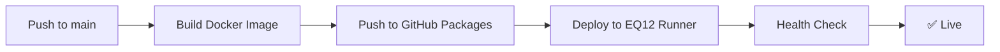

# 🏗️ EQ12 GODSTACK Deployment Guide

This guide covers the complete CI/CD deployment infrastructure for your EQ12 GODSTACK, including Docker containerization, GitHub Actions workflows, and monitoring dashboards.

---

## 🚀 Quick Start

### 1. **Environment Setup**

```bash
# 1. Copy environment template
cp .env.example .env

# 2. Edit .env with your actual secrets
# Required: TG_TOKEN, TG_CHAT_ID, OPENAI_SERVICE_KEY
# Optional: BING_KEY, GOOGLE_KEY, CODECOV_TOKEN, etc.

# 3. Start the stack
docker-compose up -d --build
```

### 2. **Access Services**

- **EQ12 Dashboard**: [http://localhost:8000](http://localhost:8000)
- **Grafana**: [http://localhost:3000](http://localhost:3000) (admin/admin)
- **Prometheus**: [http://localhost:9090](http://localhost:9090)
- **Redis**: localhost:6379

---

## 📋 Prerequisites

### GitHub Repository Setup

1. **Enable GitHub Packages**:
   - Settings → Packages → Enable GitHub Container Registry

2. **Required Secrets** (Settings → Secrets and variables → Actions):
   ```
   TG_TOKEN
   TG_CHAT_ID
   OPENAI_SERVICE_KEY
   BING_KEY
   GOOGLE_KEY
   GOOGLE_CSE_ID
   CODECOV_TOKEN
   SONAR_TOKEN
   ```

3. **Self-Hosted Runner** (Optional for production deployment):
   ```bash
   # On your EQ12 machine
   mkdir actions-runner && cd actions-runner

   # Download runner (get latest URL from GitHub repo settings)
   curl -o actions-runner-win-x64.zip -L [https://github.com/actions/runner/releases/latest/download/actions-runner-win-x64.zip](https://github.com/actions/runner/releases/latest/download/actions-runner-win-x64.zip)
   unzip actions-runner-win-x64.zip

   # Configure with your repo
   ./config.sh --url https://github.com/your-org/your-repo --token YOUR_TOKEN

   # Start runner
   ./run.sh
   ```

---

## 🐳 Docker Infrastructure

### **Dockerfile Features**
- **Multi-stage build** for optimized production images
- **Python 3.12** with Playwright and FastAPI
- **Non-root user** for security
- **Health checks** for monitoring
- **Chromium browser** for scraping capabilities

### **Docker Compose Services**

| Service | Port | Purpose |
|---------|------|---------|
| `godstack` | 8000 | Main FastAPI dashboard and API |
| `redis` | 6379 | Caching and message queue |
| `grafana` | 3000 | Monitoring dashboards |
| `prometheus` | 9090 | Metrics collection |

### **Build and Run Locally**

```bash
# Build image
docker build -t eq12-godstack .

# Run single container
docker run -d --name eq12-godstack \
  -p 8000:8000 \
  --env-file .env \
  eq12-godstack

# Or use docker-compose (recommended)
docker-compose up -d --build
```

---

## ⚙️ CI/CD Pipeline

### **GitHub Actions Workflow** (`.github/workflows/deploy.yml`)

**Triggers**:
- Push to `main` branch
- Manual workflow dispatch

**Jobs**:
1. **Build & Push**:
   - Builds Docker image
   - Pushes to GitHub Packages (`ghcr.io`)
   - Tags with branch, SHA, and `latest`

2. **Deploy** (self-hosted runner):
   - Pulls latest image
   - Stops existing container
   - Runs new container with secrets
   - Verifies deployment health check

### **Deployment Process**



---

## 📊 Monitoring & Observability

### **Grafana Dashboards**

1. **Governance Overview** (`governance-overview.json`):
   - PRs in review/blocked status
   - Gate failure counts
   - Audit pass/fail history

2. **Badge Health** (`badge-health.json`):
   - CI/CD badge status over time
   - Security badge monitoring
   - Code coverage trends

### **Prometheus Metrics**

The stack exposes metrics at `/metrics` endpoint:

- `eq12_badge_status{badge}` - Badge status (1=passing, 0=failing)
- `eq12_coverage_percentage` - Code coverage percentage
- `eq12_prs_in_review_total` - PRs in governance review
- `eq12_prs_blocked_total` - Blocked PRs count
- `eq12_gate_failures_total{gate}` - Gate failure counters

### **Custom Metrics Exporter**

Run `metrics_exporter.py` for enhanced metrics collection:

```bash
# In separate terminal or container
python metrics_exporter.py

# Metrics available at http://localhost:8001/metrics
```

---

## 🔒 Security Integration

### **DevSecOps Pipeline**

All security features integrate with the deployment:

1. **Secret Scanning**: Gitleaks prevents secret commits
2. **Code Scanning**: CodeQL runs on PRs and weekly
3. **Dependency Review**: Blocks vulnerable dependencies
4. **Container Security**: Multi-stage builds with non-root user

### **SECURITY.md Compliance**

The deployment enforces all policies in `SECURITY.md`:
- Environment variable injection (no hardcoded secrets)
- SQLite for persistence
- Logging and audit trails
- Business stack security (Betting, Cannabis, Credit)

---

## 🎯 Production Deployment Options

### **Option 1: Self-Hosted (EQ12 Machine)**
```bash
# Register EQ12 as GitHub runner
# Push to main → automatic deployment
git push origin main
```

### **Option 2: Cloud Deployment**
```bash
# Deploy to any Docker-compatible service
docker run -d \
  --env-file .env \
  -p 8000:8000 \
  ghcr.io/your-org/your-repo/eq12-godstack:latest
```

### **Option 3: Development Mode**
```bash
# Local development with hot reload
docker-compose -f docker-compose.yml -f docker-compose.dev.yml up
```

---

## 🔧 Configuration

### **Environment Variables**

| Variable | Required | Purpose |
|----------|----------|---------|
| `TG_TOKEN` | ✅ | Telegram bot token |
| `TG_CHAT_ID` | ✅ | Telegram chat ID |
| `OPENAI_SERVICE_KEY` | ✅ | OpenAI API key |
| `BING_KEY` | ❌ | Bing Search API |
| `GOOGLE_KEY` | ❌ | Google Search API |
| `REDIS_URL` | ❌ | Redis connection (defaults to service) |
| `GRAFANA_PASSWORD` | ❌ | Grafana admin password |

### **Health Checks**

All services include health checks:
- **API**: `GET /health` endpoint
- **Database**: SQLite file accessibility
- **Environment**: Required variables validation
- **Dependencies**: Service connectivity

---

## 🚨 Troubleshooting

### **Common Issues**

1. **Build failures**:
   ```bash
   # Check Docker logs
   docker-compose logs godstack

   # Rebuild without cache
   docker-compose build --no-cache
   ```

2. **Missing secrets**:
   ```bash
   # Verify environment
   docker-compose exec godstack env | grep -E "(TG_|OPENAI_)"
   ```

3. **Port conflicts**:
   ```bash
   # Check port usage
   netstat -tulpn | grep -E "(8000|3000|9090|6379)"
   ```

4. **Health check failures**:
   ```bash
   # Test health endpoint
   curl http://localhost:8000/health

   # Check container health
   docker-compose ps
   ```

---

## 📈 Next Steps

1. **Set up GitHub self-hosted runner** for automated deployments
2. **Configure Grafana alerts** for governance failures
3. **Add custom metrics** for your specific business stacks
4. **Set up backup/restore** for SQLite databases
5. **Implement log aggregation** (ELK stack integration)

---

*This infrastructure provides enterprise-grade CI/CD with monitoring for your EQ12 GODSTACK while maintaining security and governance compliance.*
