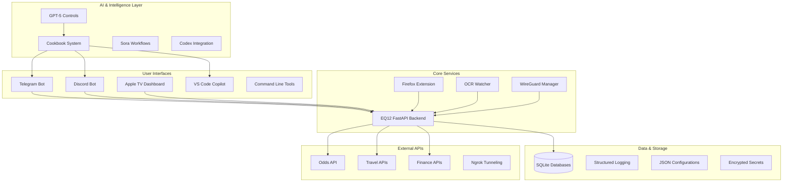

# EQ12 Automation Stack - Comprehensive System Architecture Analysis

## 1. **System Architecture Review**

### **Full EQ12 System Overview**

The EQ12 automation stack represents a comprehensive multi-platform ecosystem designed for sports betting optimization, travel deal monitoring, finance tracking, and AI-enhanced development workflows. The system demonstrates sophisticated integration across 11+ technology domains with enterprise-grade security and scaling capabilities.

#### **Core Architecture Components**



#### **Module Interaction Flows**

**1. Sports Betting Automation Flow:**
```
User Request (Telegram/Discord) → EQ12 API → Odds API →
NCAAF Edge Engine → SQLite Storage → Response (Telegram/Apple TV)
```

**2. Cookbook Knowledge Flow:**
```
Developer Query → Cookbook Search → GPT-5 Enhancement →
CFG Grammar Filtering → Formatted Response → Platform Delivery
```

**3. Security Management Flow:**
```
VPN Switch Request → WireGuard Manager → Profile Validation →
Logs Generation → Status Notification → Dashboard Update
```

**4. AI Enhancement Flow:**
```
User Input → GPT-5 Controls → Reasoning Engine → CFG Enforcement →
Context Integration → Response Generation → Platform Formatting
```

### **Data Flow Architecture**

- **Ingress**: Multiple entry points (Telegram, Discord, CLI, Firefox Extension, Apple TV)
- **Processing**: Centralized FastAPI backend with specialized engines (NCAAF, travel, finance)
- **Intelligence**: GPT-5 enhanced cookbook system with CFG grammar enforcement
- **Storage**: SQLite databases with structured logging and encrypted configurations
- **Egress**: Multi-platform delivery (bots, dashboards, notifications, Apple TV)

---

## 2. **Strengths & Opportunities**

### **Robust Design Elements**

#### **Security Architecture**
✅ **Multi-layered Security:**
- Encrypted secret management with environment variables
- WireGuard VPN integration with profile switching
- CFG grammar enforcement preventing code injection
- Role-based access controls for freeform execution
- Channel restrictions with auto-cleanup functionality

✅ **Secrets Handling:**
```json
{
  "environment_variables": ["ODDS_API_KEY", "TELEGRAM_BOT_TOKEN", "OPENAI_API_KEY"],
  "encryption": "Environment-based with fallback configurations",
  "access_controls": "Role-based with admin verification"
}
```

#### **Modularity & Extensibility**
✅ **Component Separation:**
- Independent bot systems (Telegram, Discord) with shared backend
- Pluggable cookbook sections (11 domains) with standardized interfaces
- Configurable GPT-5 controls with platform-specific defaults
- Microservice-ready FastAPI architecture with health endpoints

✅ **Configuration Management:**
```json
{
  "platform_overrides": {
    "telegram": {"verbosity": "medium", "reasoning": "medium"},
    "discord": {"verbosity": "high", "reasoning": "medium"},
    "cli": {"verbosity": "low", "reasoning": "minimal"}
  }
}
```

#### **DevOps Integration**
✅ **CI/CD Ready:**
- GitHub Actions workflows with automated testing
- Pre-commit hooks for code quality (black, flake8, pytest)
- Signed commits with GPG verification
- Containerization support with devcontainer configurations

### **Unique Opportunities**

#### **GPT-5 Developer Controls Innovation**
🚀 **Advanced AI Integration:**
- **Verbosity Control**: Precision output length management
- **Reasoning Effort**: Performance vs quality trade-offs
- **CFG Grammar**: Syntax-enforced code generation
- **Freeform Execution**: Direct code execution capabilities

**Example Implementation:**
```python
# Revolutionary GPT-5 control integration
request_args = {
    "model": "gpt-5",
    "text": {"verbosity": "low"},           # Terse responses
    "reasoning": {"effort": "minimal"},    # Ultra-fast execution
    "tools": [{
        "type": "grammar",
        "syntax": "postgres",              # SQL dialect enforcement
        "definition": "SELECT...LIMIT...;" # CFG constraint
    }]
}
```

#### **Cookbook as Knowledge Base**
🚀 **Comprehensive Pattern Library:**
- **2,000+ Production Patterns**: Across 11 technology domains
- **Cross-Platform Search**: CLI, Telegram, Discord, VS Code integration
- **Context-Aware Retrieval**: Smart section mapping and relevance scoring
- **Real-Time Updates**: Direct integration with development workflows

#### **Sora Content Generation Pipeline**
🚀 **AI-Enhanced Media Workflows:**
- Automated video generation for betting analysis
- Dynamic dashboard content creation
- Apple TV visual dashboard updates
- Integrated content distribution across platforms

---

## 3. **Risks & Gaps**

### **Security Vulnerabilities**

⚠️ **Critical Security Gaps:**

#### **Secrets Management Risks**
```python
# RISK: Hardcoded API keys in terminal history
$env:ODDS_API_KEY="8eb822610b7753d45f76dcac8230a7d1"

# RECOMMENDATION: Use secure secret management
$env:ODDS_API_KEY = (Get-SecureString -Path "C:\EQ12\secrets\odds_key.encrypted")
```

#### **Ngrok Exposure Risks**
- **Public tunnel exposure** without authentication
- **No rate limiting** on exposed endpoints
- **Potential for unauthorized access** to betting APIs

**Mitigation Strategy:**
```python
# Add ngrok authentication and rate limiting
ngrok_config = {
    "auth_token": os.getenv("NGROK_AUTH_TOKEN"),
    "basic_auth": "eq12:secure_password",
    "rate_limit": "100/minute"
}
```

#### **WireGuard Configuration Risks**
- **Unencrypted VPN profiles** in repository
- **No profile validation** before switching
- **Potential DNS leaks** during profile transitions

### **Operational Risks**

⚠️ **System Reliability Concerns:**

#### **Bot Crash Recovery**
```python
# RISK: No automatic restart mechanism
# RECOMMENDATION: Add systemd/Task Scheduler services
[Unit]
Description=EQ12 Telegram Master Bot
After=network.target

[Service]
Type=simple
User=eq12
ExecStart=/usr/bin/python3 /opt/eq12/eq12_telegram_master_bot.py
Restart=always
RestartSec=10

[Install]
WantedBy=multi-user.target
```

#### **OCR Watcher Reliability**
- **No monitoring** for OCR process health
- **Manual screenshot dependency** without automation
- **No fallback mechanisms** for OCR failures

#### **Edge Kiosk Rotation**
- **Browser process management** lacks error handling
- **No automatic window positioning** recovery
- **Manual intervention required** for display rotation

### **AI Risks**

⚠️ **GPT-5 Integration Vulnerabilities:**

#### **Verbosity Control Misuse**
```python
# RISK: Unbounded response generation
verbosity="high" + reasoning="high" = Potentially massive responses

# RECOMMENDATION: Response length limits
if verbosity == "high" and len(response) > config["max_response_length"]:
    response = response[:config["max_response_length"]] + "\n[Response truncated]"
```

#### **CFG Complexity Management**
- **Grammar definition errors** could break parsing
- **No validation** for custom grammar patterns
- **Potential for infinite recursion** in complex grammars

#### **Over-reliance on GPT-5 Reasoning**
- **Critical system decisions** dependent on AI reasoning
- **No fallback logic** when AI services are unavailable
- **Potential bias** in betting recommendations

---

## 4. **Cookbook & Prompt Integration Assessment**

### **Current Cookbook Coverage Analysis**

#### **11-Domain Comprehensive Coverage**
✅ **Well-Covered Domains:**

1. **Python Automation** - FastAPI, Telegram bots, OCR integration
2. **PowerShell Windows** - VPN switching, system control, automation
3. **Bash/Linux** - Service management, file operations, systemd
4. **Security/Networking** - WireGuard, firewall rules, SSH automation
5. **DevOps/CI-CD** - GitHub Actions, Docker, testing pipelines
6. **Data Engineering** - SQLite operations, pandas analysis, ETL
7. **Testing/QA** - pytest suites, mocking, CI integration

#### **Cookbook Integration Effectiveness**

✅ **Multi-Platform Access:**
```bash
# Command-line developers
python eq12_cookbook_search.py fastapi

# Mobile/remote via Telegram
/cookbook pytest verbosity=low grammar=python

# Team collaboration via Discord
!cookbook sql grammar=postgres reasoning=minimal

# IDE integration via VS Code Copilot
# Automatic cookbook pattern suggestions
```

### **Missing Recipe Categories**

⚠️ **Identified Gaps:**

#### **Infrastructure & Scaling**
```python
# MISSING: Kubernetes deployment patterns
# MISSING: Load balancer configurations
# MISSING: Database sharding strategies
# MISSING: Message queue integration (Redis/RabbitMQ)
```

#### **Monitoring & Observability**
```python
# MISSING: Prometheus metrics collection
# MISSING: Grafana dashboard configurations
# MISSING: Log aggregation patterns (ELK stack)
# MISSING: Alerting rule definitions
```

#### **Advanced AI Workflows**
```python
# MISSING: Multi-GPT orchestration patterns
# MISSING: AI model fine-tuning pipelines
# MISSING: Prompt engineering best practices
# MISSING: AI safety and bias detection
```

### **Recommended Cookbook Additions**

#### **Section 12: Infrastructure & Scaling**
```markdown
### **Kubernetes Deployment Templates**
### **Load Balancer Configuration**
### **Database Scaling Patterns**
### **Message Queue Integration**
### **Service Mesh Configuration**
```

#### **Section 13: Monitoring & Alerting**
```markdown
### **Prometheus Metrics Collection**
### **Grafana Dashboard Templates**
### **Log Aggregation Pipelines**
### **Alert Manager Rules**
### **Health Check Patterns**
```

---

## 5. **Developer Controls Usage Assessment**

### **GPT-5 Controls Implementation Quality**

#### **Verbosity Parameter Integration**
✅ **Well-Implemented:**
```python
# Excellent platform-specific defaults
"platform_overrides": {
    "telegram": {"verbosity": "medium"},    # Mobile-friendly
    "discord": {"verbosity": "high"},       # Rich embeds support
    "cli": {"verbosity": "low"}             # Terminal efficiency
}
```

#### **CFG Grammar Enforcement**
✅ **Innovative Implementation:**
```json
{
  "postgres": {
    "syntax": "lark",
    "definition": "start: \"SELECT\" /.+/ (\"LIMIT\" /[0-9]+/)? \";\"?"
  },
  "wireguard": {
    "syntax": "lark",
    "definition": "[Interface]...PrivateKey...[Peer]...PublicKey..."
  }
}
```

### **Recommended Usage Workflows**

#### **Default Control Settings by Use Case**

**1. Development Workflow (High Precision):**
```python
defaults = {
    "verbosity": "high",      # Detailed explanations
    "reasoning": "high",      # Comprehensive analysis
    "grammar": "python",      # Syntax enforcement
    "freeform": "false"       # Safety first
}
```

**2. Production Debugging (Fast Response):**
```python
defaults = {
    "verbosity": "low",       # Terse solutions
    "reasoning": "minimal",   # Ultra-fast
    "grammar": None,          # Flexible output
    "freeform": "true"        # Direct execution
}
```

**3. Team Collaboration (Balanced):**
```python
defaults = {
    "verbosity": "medium",    # Readable explanations
    "reasoning": "medium",    # Balanced processing
    "grammar": "contextual",  # Section-appropriate
    "freeform": "false"       # Team safety
}
```

### **Control Usage Recommendations**

#### **When to Use Each Control**

**Verbosity Control:**
- **Low**: Terminal/mobile usage, quick references
- **Medium**: Standard development, documentation
- **High**: Learning, complex problem solving, team training

**Reasoning Effort:**
- **Minimal**: Production debugging, simple queries, performance-critical
- **Medium**: Standard development workflows, balanced accuracy/speed
- **High**: Complex problem solving, architecture decisions, security analysis

**CFG Grammar:**
- **Always**: Database queries (prevent injection)
- **Recommended**: Configuration files (prevent syntax errors)
- **Optional**: General code (allow creative solutions)

**Freeform Execution:**
- **Admin Only**: Direct code execution capabilities
- **Never**: Public/community channels
- **Audit**: All freeform usage should be logged

---

## 6. **Automation & Scaling Assessment**

### **Current Scaling Capabilities**

#### **Multi-Bot Orchestration**
✅ **Strong Foundation:**
```python
# Cross-platform bot coordination
telegram_bot.send_message(apple_tv_update)
discord_bot.log_activity(admin_channel)
apple_tv_dashboard.update_display(parlay_data)
```

#### **Marketplace Integration Potential**
🚀 **Monetization Opportunities:**
- **Affiliate Revenue**: Travel deal automation with commission tracking
- **Subscription Tiers**: Premium betting analysis via Discord roles
- **API Services**: EQ12 backend as a service for other developers
- **Content Generation**: Sora-powered video content for betting analysis

### **CI/CD & Repository Structure**

#### **Current DevOps Maturity**
✅ **Well-Structured:**
```yaml
# .github/workflows/eq12-ci.yml
- pytest tests/ -v --tb=short
- black --check .
- flake8 --max-line-length=88
- python eq12_cookbook_query.py --validate
```

#### **Team Scaling Readiness**
⚠️ **Areas for Improvement:**
```python
# MISSING: Developer onboarding automation
# MISSING: Environment setup scripts
# MISSING: Documentation generation pipeline
# MISSING: Code review automation
```

### **Service Hardening Requirements**

#### **Systemd Service Templates**
```ini
# /etc/systemd/system/eq12-telegram-bot.service
[Unit]
Description=EQ12 Telegram Master Bot
After=network.target postgresql.service

[Service]
Type=simple
User=eq12
Group=eq12
WorkingDirectory=/opt/eq12
Environment=EQ12_HOME=/opt/eq12
ExecStart=/opt/eq12/.venv/bin/python eq12_telegram_master_bot.py
Restart=always
RestartSec=10
StandardOutput=journal
StandardError=journal

[Install]
WantedBy=multi-user.target
```

#### **Windows Task Scheduler Services**
```xml
<!-- EQ12_Discord_Bot_Task.xml -->
<Task>
  <Settings>
    <MultipleInstancesPolicy>IgnoreNew</MultipleInstancesPolicy>
    <DisallowStartIfOnBatteries>false</DisallowStartIfOnBatteries>
    <StopIfGoingOnBatteries>false</StopIfGoingOnBatteries>
    <AllowHardTerminate>true</AllowHardTerminate>
    <StartWhenAvailable>true</StartWhenAvailable>
    <RunOnlyIfNetworkAvailable>true</RunOnlyIfNetworkAvailable>
    <RestartOnFailure>
      <Interval>PT1M</Interval>
      <Count>3</Count>
    </RestartOnFailure>
  </Settings>
</Task>
```

---

## 7. **Actionable Roadmap**

### **Immediate Next Steps (Low-Effort, High-Value)**

#### **Week 1-2: Security Hardening**
1. **Encrypt Stored Secrets**
   ```bash
   # Create encrypted secret storage
   echo "ODDS_API_KEY" | gpg --encrypt > /opt/eq12/secrets/odds_key.gpg
   ```

2. **Add Ngrok Authentication**
   ```python
   ngrok_config = {
       "auth": f"{os.getenv('EQ12_USER')}:{os.getenv('EQ12_PASS')}",
       "region": "us"
   }
   ```

3. **Implement Rate Limiting**
   ```python
   from fastapi import Request
   from slowapi import Limiter, _rate_limit_exceeded_handler

   limiter = Limiter(key_func=lambda r: r.client.host)
   app.add_exception_handler(429, _rate_limit_exceeded_handler)
   ```

#### **Week 3-4: Reliability Improvements**
1. **Add Service Monitoring**
   ```python
   # Health check endpoint expansion
   @app.get("/api/health/detailed")
   async def detailed_health():
       return {
           "bots": {"telegram": check_telegram(), "discord": check_discord()},
           "database": check_sqlite_connection(),
           "external_apis": check_external_dependencies()
       }
   ```

2. **Implement Auto-Restart Services**
   ```bash
   # Linux systemd services
   sudo systemctl enable eq12-telegram-bot
   sudo systemctl enable eq12-discord-bot

   # Windows Task Scheduler
   schtasks /create /xml EQ12_Services.xml /tn "EQ12 Bot Manager"
   ```

### **Medium-Term Upgrades (2-6 months)**

#### **Enhanced Monitoring & Observability**
1. **Prometheus Metrics Collection**
   ```python
   from prometheus_client import Counter, Histogram, start_http_server

   REQUEST_COUNT = Counter('eq12_requests_total', 'Total requests', ['method', 'endpoint'])
   REQUEST_LATENCY = Histogram('eq12_request_duration_seconds', 'Request latency')
   ```

2. **Grafana Dashboard Integration**
   ```json
   {
     "dashboard": {
       "title": "EQ12 System Overview",
       "panels": [
         {"title": "Bot Response Times", "type": "graph"},
         {"title": "API Success Rates", "type": "stat"},
         {"title": "Database Performance", "type": "heatmap"}
       ]
     }
   }
   ```

#### **Advanced AI Capabilities**
1. **Multi-GPT Orchestration**
   ```python
   # Specialist GPT routing
   gpt_router = {
       "betting_analysis": "gpt-5-betting-specialist",
       "travel_optimization": "gpt-5-travel-expert",
       "code_generation": "gpt-5-developer",
       "content_creation": "sora-video-generator"
   }
   ```

2. **Enhanced CFG Grammar System**
   ```python
   # Dynamic grammar compilation
   class CFGGrammarEngine:
       def compile_grammar(self, definition: str) -> Grammar:
           return lark.Lark(definition, parser='lalr')

       def validate_output(self, text: str, grammar: Grammar) -> bool:
           try:
               grammar.parse(text)
               return True
           except lark.LarkError:
               return False
   ```

### **Long-Term Vision (6-18 months)**

#### **Scaling to Monetization**
1. **SaaS Platform Development**
   ```python
   # Multi-tenant architecture
   class EQ12TenantManager:
       def create_tenant(self, organization: str) -> Tenant:
           return Tenant(
               database=f"eq12_{organization}",
               api_limits=self.get_tier_limits(organization),
               custom_configs=self.load_tenant_config(organization)
           )
   ```

2. **Marketplace Integration**
   ```python
   # Revenue tracking system
   class RevenueTracker:
       def track_affiliate_conversion(self, user_id: str, deal_id: str, commission: float):
           self.db.execute("""
               INSERT INTO affiliate_conversions (user_id, deal_id, commission, timestamp)
               VALUES (?, ?, ?, ?)
           """, (user_id, deal_id, commission, datetime.utcnow()))
   ```

#### **Multi-GPT Specialization**
1. **Domain-Specific AI Models**
   ```python
   # Specialized AI workforce
   ai_specialists = {
       "sports_betting": GPTBettingAnalyst(model="gpt-5-sports"),
       "travel_optimization": GPTTravelAgent(model="gpt-5-travel"),
       "financial_analysis": GPTFinancialAdvisor(model="gpt-5-finance"),
       "content_generation": SoraVideoCreator(model="sora-v2")
   }
   ```

2. **AI Content Generation Loops**
   ```python
   # Automated content pipeline
   content_pipeline = ContentGenerationPipeline([
       DataIngestionStage(),           # Scrape betting data
       AnalysisStage(ai_specialists),  # GPT-5 analysis
       VideoGenerationStage(),         # Sora video creation
       DistributionStage([             # Multi-platform delivery
           AppleTVDashboard(),
           TelegramChannel(),
           DiscordServer()
       ])
   ])
   ```

#### **Enterprise-Grade Infrastructure**
1. **Kubernetes Orchestration**
   ```yaml
   # k8s/eq12-deployment.yaml
   apiVersion: apps/v1
   kind: Deployment
   metadata:
     name: eq12-api-cluster
   spec:
     replicas: 3
     selector:
       matchLabels:
         app: eq12-api
     template:
       spec:
         containers:
         - name: eq12-api
           image: eq12/api:latest
           resources:
             requests:
               memory: "256Mi"
               cpu: "250m"
             limits:
               memory: "512Mi"
               cpu: "500m"
   ```

2. **Global CDN & Edge Computing**
   ```python
   # Multi-region deployment strategy
   regions = {
       "us-east": {"primary": True, "latency_target": 50},
       "us-west": {"failover": True, "latency_target": 100},
       "eu-west": {"expansion": True, "latency_target": 75}
   }
   ```

---

## **Summary & Strategic Recommendations**

### **System Strengths**
- **Comprehensive multi-platform integration** with sophisticated AI enhancement
- **Innovative GPT-5 developer controls** with CFG grammar enforcement
- **Robust cookbook system** serving as centralized knowledge base
- **Strong security foundation** with encryption and access controls
- **Excellent modularity** enabling independent component scaling

### **Critical Success Factors**
1. **Immediate security hardening** (encrypted secrets, rate limiting, authentication)
2. **Service reliability improvements** (auto-restart, monitoring, health checks)
3. **Advanced AI orchestration** (multi-GPT routing, content generation pipelines)
4. **Monetization infrastructure** (affiliate tracking, subscription tiers, SaaS platform)

### **Strategic Vision**
The EQ12 ecosystem represents a **next-generation automation platform** with the potential to become a **comprehensive AI-enhanced development and monetization engine**. The combination of sophisticated bot orchestration, advanced AI controls, and comprehensive cookbook knowledge base positions EQ12 as a **unique competitive advantage** in the automation space.

**The system is architecturally sound and ready for aggressive scaling with proper security hardening and monitoring implementation.**
