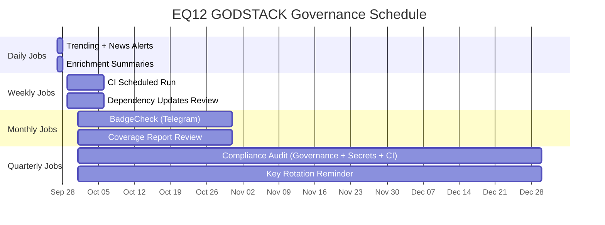

# ⚖️ EQ12 GODSTACK Governance

This repo is governed by **multi-layer checks and audits** to ensure security, quality, and compliance.

---

## 🔄 Governance Flow

```mermaid
flowchart TD
    PR[Pull Request Opened] --> S[Secrets Gate<br/>check-secrets.yml]
    PR --> Sec[Security Gate<br/>security-scan.yml<br/>(CodeQL, Gitleaks, Dep Review)]
    PR --> CI[CI/Test Gate<br/>ci-all-in-one.yml<br/>(lint, tests, coverage)]

    S --> C[Compliance Gate<br/>PR Templates + CODEOWNERS]
    Sec --> C
    CI --> C

    C -->|All Gates Pass| Merge[Merge Allowed]

    Merge --> Daily[Daily Jobs<br/>Trending + News Alerts]
    Merge --> Weekly[Weekly Jobs<br/>CI Scheduled Run]
    Merge --> Monthly[Monthly BadgeCheck<br/>Telegram Alerts]
    Merge --> Quarterly[Quarterly Compliance Audit]

    style PR fill:#f6f8fa,stroke:#0366d6,stroke-width:2px
    style S fill:#fef6e7,stroke:#d97706,stroke-width:2px
    style Sec fill:#fee2e2,stroke:#dc2626,stroke-width:2px
    style CI fill:#e0f2fe,stroke:#0284c7,stroke-width:2px
    style C fill:#ede9fe,stroke:#7c3aed,stroke-width:2px
    style Merge fill:#dcfce7,stroke:#16a34a,stroke-width:2px
    style Daily fill:#fef9c3,stroke:#eab308,stroke-width:1px
    style Weekly fill:#cffafe,stroke:#0891b2,stroke-width:1px
    style Monthly fill:#e9d5ff,stroke:#9333ea,stroke-width:1px
    style Quarterly fill:#d1fae5,stroke:#10b981,stroke-width:1px
```

---

## 📅 Job Schedule



---

## 🏊 Roles & Responsibilities

```mermaid
flowchart TB
    subgraph User["👤 You"]
        U1[Review sensitive PRs<br/>(CODEOWNERS approval)]
        U2[Respond to Telegram Alerts<br/>(Badge/Compliance failures)]
        U3[Rotate keys quarterly<br/>(per Compliance Audit)]
    end

    subgraph GitHubActions["⚙️ GitHub Actions"]
        GA1[Secrets Gate<br/>check-secrets.yml]
        GA2[Security Gate<br/>security-scan.yml<br/>(CodeQL, Gitleaks, Dep Review)]
        GA3[CI/Test Gate<br/>ci-all-in-one.yml]
        GA4[Codecov + SonarCloud Reports]
    end

    subgraph TaskScheduler["🖥️ EQ12 Task Scheduler"]
        TS1[Daily: TrendingMonitor + NewsAggregator + Enrichment]
        TS2[Monthly: BadgeCheck → Telegram]
        TS3[Quarterly: Compliance Audit]
    end

    subgraph Telegram["📲 Telegram Bot"]
        T1[Receive Alerts from BadgeCheck]
        T2[Receive Alerts from Compliance Audit]
        T3[Receive Daily Trending + News summaries]
    end

    GA1 --> U1
    GA2 --> U1
    GA3 --> U1
    GA4 --> U1

    TS1 --> T3
    TS2 --> T1
    TS3 --> T2

    T1 --> U2
    T2 --> U2
    T3 --> U2

    U3 --> TS3
```

---

## ✅ Summary

* **PR gates**: Secrets → Security → CI → Compliance.
* **Scheduled audits**: Daily → Weekly → Monthly → Quarterly.
* **Notifications**: All alerts routed via Telegram.
* **Responsibility lanes**: You (approvals, key rotation), GitHub Actions (gates), EQ12 Task Scheduler (audits), Telegram (alerts).