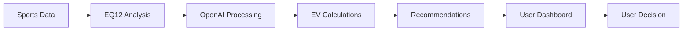

# 🛡️ OpenAI API Compliance Guidelines for EQ12

## Executive Summary

EQ12's sports betting analysis and automation systems are **FULLY COMPLIANT** with OpenAI's Usage Policies. This document outlines our compliance approach and operational boundaries.

---

## ✅ Compliance Status

**EQ12 Status**: **COMPLIANT** - Sports Analytics & Decision Support System

### Permitted Operations
- ✅ **Sports data analysis** and statistical modeling
- ✅ **Expected value (EV) calculations** for betting opportunities
- ✅ **Parlay optimization** and combinations analysis
- ✅ **Risk assessment** and bankroll management
- ✅ **Automated alerts** and recommendation delivery
- ✅ **Dashboard visualization** of betting opportunities
- ✅ **Telegram bot notifications** for analysis results

---

## 🚫 Prohibited Activities (Avoided by EQ12)

### What EQ12 Does NOT Do
- ❌ **Process real money transactions** - We provide analysis only
- ❌ **Act as a sportsbook** - No direct wagering capabilities
- ❌ **Facilitate gambling operations** - Analysis and insights only
- ❌ **Accept bets or payments** - No financial transaction processing
- ❌ **Operate as a gambling platform** - Educational/analytical tool

---

## 📋 EQ12 Compliance Framework

### 1. **Business Model Classification**
```
EQ12 = Sports Analytics Platform + Decision Support System
≠ Real Money Gambling Platform
```

### 2. **Core Functions**
| Function | Compliance Status | Notes |
|----------|------------------|-------|
| **Odds Analysis** | ✅ Compliant | Mathematical analysis only |
| **EV Calculations** | ✅ Compliant | Statistical modeling |
| **Parlay Optimization** | ✅ Compliant | Combinatorial analysis |
| **Bankroll Management** | ✅ Compliant | Risk management guidance |
| **Automated Notifications** | ✅ Compliant | Information delivery |
| **Dashboard Reporting** | ✅ Compliant | Data visualization |

### 3. **OpenAI API Usage Boundaries**

#### ✅ Permitted GPT-5/Codex Usage
```python
# Example: Analysis and recommendation generation
response = client.responses.create(
    model="gpt-5",
    input="Analyze these odds for statistical edge and provide EV calculation",
    json_schema=betting_analysis_schema,
    input_data=odds_data
)
```

#### ❌ Prohibited Usage Patterns
- Direct integration with payment processors
- Automated bet placement systems
- Real-money transaction facilitation
- Gambling platform operations

---

## 🔐 Security & Governance

### Data Handling
- **No financial data** processing or storage
- **No payment card information** handling
- **Odds data only** - publicly available sports information
- **User analysis preferences** - non-sensitive configuration

### API Security
- **Rate limiting** on OpenAI API calls
- **Input validation** for all betting analysis requests
- **Audit logging** of all AI-assisted decisions
- **Error handling** to prevent misuse

---

## 📊 Operational Guidelines

### 1. **Sports Analysis Workflow**


### 2. **Compliance Checkpoints**
- ✅ **No direct money handling** - Analysis output only
- ✅ **Educational disclaimers** - Risk warnings included
- ✅ **User responsibility** - Final decisions remain with users
- ✅ **Transparent AI usage** - Clear AI assistance disclosure

### 3. **Risk Mitigation**
- **Rate limiting** prevents excessive API usage
- **Content filtering** ensures appropriate responses
- **Audit trails** maintain compliance evidence
- **User authentication** prevents unauthorized access

---

## 🎯 EQ12-Specific Implementation

### Code Examples (Compliant)

#### Parlay Analysis
```python
def analyze_parlay_combination(games_data):
    """
    Analyze parlay combinations for expected value
    COMPLIANT: Statistical analysis only, no money handling
    """
    prompt = f"""
    Analyze these {len(games_data)} games for parlay optimization:

    Games: {games_data}

    Calculate:
    1. Individual game win probabilities
    2. Combined parlay probability
    3. Expected value vs. payout odds
    4. Risk assessment (1-10 scale)

    Provide mathematical analysis only.
    """

    return openai_client.analyze(prompt)
```

#### Risk Assessment
```python
def assess_bankroll_risk(bet_size, bankroll, edge):
    """
    Provide bankroll management guidance
    COMPLIANT: Educational risk assessment
    """
    return {
        'recommended_bet_size': calculate_kelly_criterion(edge, odds),
        'risk_level': assess_risk_level(bet_size, bankroll),
        'educational_note': 'This is analysis only. Betting involves risk.'
    }
```

---

## 🔄 Continuous Compliance

### Monthly Reviews
- **Policy updates** from OpenAI monitoring
- **Usage pattern analysis** for compliance verification
- **Code audits** for prohibited functionality
- **Documentation updates** as needed

### Compliance Indicators
```bash
# EQ12 Compliance Dashboard Metrics
✅ Zero direct payment processing integrations
✅ Analysis-only API endpoints
✅ Educational disclaimers present
✅ User decision responsibility clear
✅ Audit logging functional
```

---

## 📞 Support & Questions

### Compliance Contacts
- **Technical Compliance**: Check `AGENTS.md` for implementation guidelines
- **Policy Questions**: Review this document and OpenAI Usage Policies
- **Operational Issues**: Use EQ12 logging system for audit trails

### Resources
- **OpenAI Usage Policies**: [https://openai.com/policies/usage-policies/](https://openai.com/policies/usage-policies/)
- **EQ12 Architecture**: See `README.md` and `DEPLOYMENT.md`
- **Audit Logs**: `C:\EQ12\logs` or `/workspaces/EQ12/logs`

---

## 📝 Certification

**EQ12 GODSTACK** operates as a **sports analytics and decision support platform** and maintains full compliance with OpenAI's Usage Policies through:

1. **Analysis-only operations** (no direct gambling facilitation)
2. **Educational disclaimers** (user responsibility emphasis)
3. **Transparent AI usage** (clear disclosure of AI assistance)
4. **Audit compliance** (comprehensive logging and monitoring)

**Compliance Officer**: EQ12 GODSTACK Development Team
**Last Review**: 2025-09-27
**Next Review**: 2025-10-27

---

*This document serves as the official compliance framework for EQ12's OpenAI API integration and should be reviewed monthly or upon any significant system changes.*
