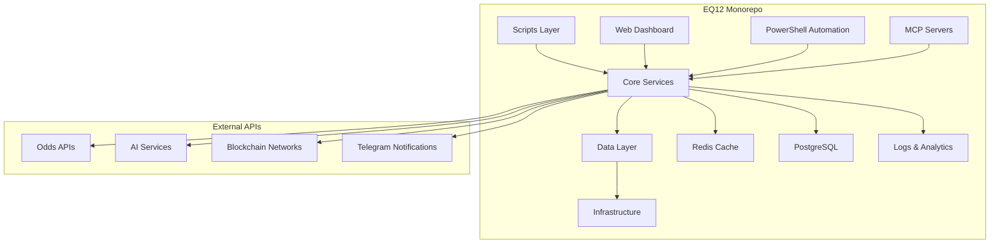

# EQ12 Architecture Documentation

##  System Architecture

### High-Level Overview


### Service Architecture

#### Core Services (Docker Compose)
- **EQ12 Godstack**: Main application container (FastAPI)
- **Redis**: Caching and session storage
- **PostgreSQL**: Primary database
- **Grafana**: Monitoring and dashboards  
- **Jupyter**: Data science notebooks
- **Metabase/Superset**: Business intelligence

#### Application Layers

**1. Scripts Layer (`/scripts`)**
- 408 Python automation scripts
- Sports betting intelligence
- Web scraping and data collection
- AI/ML model integration

**2. PowerShell Automation (`*.ps1`)**
- Windows automation (1,088 scripts)
- System administration
- Build and deployment automation

**3. Web Services (`/dashboard`)**
- FastAPI web application
- Real-time dashboards
- API endpoints

**4. Data Layer (`/data`, `/logs`)**
- SQLite databases for local storage
- Structured logs in JSON format
- Analytics and metrics

### Technology Stack

#### Backend
- **Python 3.12**: Primary runtime
- **FastAPI**: Web framework
- **Pandas/NumPy**: Data processing
- **OpenAI GPT**: AI integration
- **Web3.py**: Blockchain interaction

#### Frontend
- **HTML/CSS/JavaScript**: Web dashboards
- **Chart.js**: Data visualization
- **Real-time updates**: WebSocket integration

#### Infrastructure
- **Docker**: Containerization
- **Redis**: Caching layer
- **PostgreSQL**: Primary database
- **Grafana**: Monitoring
- **GitHub Actions**: CI/CD

### Data Flow

1. **Data Ingestion**
   - Scheduled scrapers collect sports data
   - Real-time APIs provide live updates
   - External webhooks trigger events

2. **Processing Pipeline**
   - Raw data validation and cleaning
   - AI analysis and prediction models
   - Risk calculation and optimization

3. **Storage & Caching**
   - Structured data  PostgreSQL
   - Temporary data  Redis
   - Analytics  Time-series storage

4. **Output Generation**
   - Web dashboards for monitoring
   - Telegram notifications
   - API responses for integration

### Security Architecture

#### Authentication & Authorization
- API key management via environment variables
- Service-to-service authentication
- Rate limiting and request validation

#### Data Protection
- Environment variable isolation
- Encrypted communication (HTTPS/TLS)
- Secure credential storage

#### Monitoring & Auditing
- Comprehensive logging
- Security event detection
- Performance monitoring

### Deployment Architecture

#### Development Environment
```bash
# Local development with DevContainer
.devcontainer/
 devcontainer.json    # VS Code configuration
 Dockerfile          # Development container
 postCreate.ps1      # Setup automation
```

#### Production Deployment
```bash
# Docker Compose stack
docker-compose.yml      # Service orchestration
 godstack           # Main application
 redis              # Cache layer  
 postgresql         # Database
 grafana            # Monitoring
 jupyter            # Analytics
```

### Scalability Considerations

#### Horizontal Scaling
- Microservice architecture ready
- Container orchestration with Kubernetes
- Load balancing for web services

#### Performance Optimization
- Redis caching layer
- Database query optimization
- Async processing with background tasks

#### Monitoring & Observability
- Grafana dashboards
- Structured logging
- Health check endpoints
- Performance metrics collection

---

##  Data Models

### Core Entities

#### Sports Data Model
```python
class Game:
    id: str
    home_team: str
    away_team: str
    start_time: datetime
    odds: Dict[str, float]
    live_score: Optional[Dict]
```

#### Betting Model
```python
class Parlay:
    id: str
    legs: List[Bet]
    total_odds: float
    expected_value: float
    risk_assessment: RiskMetrics
```

### Database Schema

#### Primary Tables
- `games`: Scheduled and live games
- `odds`: Historical and live odds data
- `bets`: Placed bets and outcomes
- `analytics`: Performance metrics
- `logs`: System events and errors

---

##  Development Workflow

### Local Development
1. Clone repository: `git clone <repo>`
2. Start DevContainer: VS Code  Reopen in Container
3. Run setup: `.\ops\bootstrap.ps1`
4. Start services: `.\ops\make.ps1 up`

### Testing Strategy
- **Unit Tests**: pytest for Python components
- **Integration Tests**: Docker Compose test environment
- **E2E Tests**: Automated browser testing
- **Load Tests**: Performance validation

### Deployment Pipeline
1. **Code Review**: Pull request validation
2. **Automated Testing**: CI pipeline execution
3. **Security Scanning**: Dependency and secret scanning
4. **Container Building**: Docker image creation
5. **Production Deployment**: Blue-green deployment strategy

---

##  Performance Benchmarks

### System Requirements
- **Memory**: 8GB minimum, 16GB recommended
- **CPU**: 4 cores minimum, 8 cores recommended
- **Storage**: 100GB available space
- **Network**: Stable internet connection

### Performance Targets
- **API Response Time**: < 200ms average
- **Data Processing**: < 10 seconds for full analysis
- **Uptime**: 99.9% availability
- **Throughput**: 1000 requests/minute

---

##  External Integrations

### APIs & Services
- **Odds Providers**: Multiple sports betting APIs
- **AI Services**: OpenAI, Claude, other LLMs  
- **Notification**: Telegram Bot API
- **Analytics**: Custom metrics and reporting

### Blockchain Integration
- **Ethereum**: Smart contract interaction
- **DeFi Protocols**: Yield farming automation
- **Web3 Libraries**: Transaction processing

---

This architecture supports the complex requirements of the EQ12 platform while maintaining scalability, security, and maintainability. The modular design allows for independent development and deployment of components.