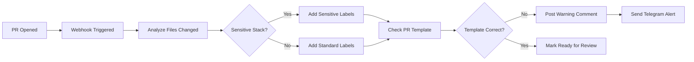
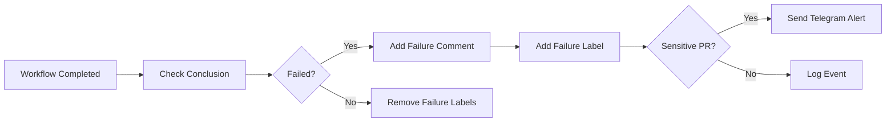

# 🤖 EQ12 Compliance Bot - GitHub App Blueprint

Complete GitHub App implementation for automated EQ12 GODSTACK governance enforcement.

---

## 🎯 **Overview**

**EQ12 Compliance Bot** is a GitHub App that automatically enforces governance rules for your EQ12 GODSTACK repository. It monitors pull requests, workflow runs, and secret scanning alerts to ensure compliance with your DevSecOps pipeline.

### **Key Features**
- ✅ **Real-time PR monitoring** with sensitive stack detection
- ✅ **Automated compliance checking** for governance gates
- ✅ **Telegram alerts** for critical violations
- ✅ **Copilot extension** with `/check-pr` command
- ✅ **GitHub API integration** (REST + GraphQL)
- ✅ **Webhook-driven** real-time enforcement

---

## 🛠️ **Setup Instructions**

### **1. Create GitHub App**

1. Go to GitHub → Settings → Developer settings → GitHub Apps
2. Click "New GitHub App"
3. Configure:
   ```
   GitHub App name: EQ12 Compliance Bot
   Homepage URL: https://your-eq12-server.com
   Webhook URL: https://your-eq12-server.com:8001/webhook
   Webhook secret: [generate secure random string]
   ```

### **2. Set Permissions**
```
Repository permissions:
- Pull requests: Read & Write
- Issues: Read & Write  
- Checks: Read
- Actions: Read
- Metadata: Read

Subscribe to events:
- Pull request
- Workflow run
- Secret scanning alert
```

### **3. Install App**
- Install on your `edgegod-parlay` repository
- Note the App ID and download private key

### **4. Configure Environment**
```bash
# Create .env file
GITHUB_APP_ID=123456
GITHUB_PRIVATE_KEY_PATH=./github-app-private-key.pem
GITHUB_WEBHOOK_SECRET=your_webhook_secret_here
TG_TOKEN=your_telegram_bot_token
TG_CHAT_ID=your_telegram_chat_id
ALERT_MANAGER_URL=http://localhost:9100/webhook
```

### **5. Run Compliance Bot**
```bash
# Install dependencies
pip install fastapi uvicorn pyjwt cryptography requests

# Start server
python governance/compliance_bot.py

# Server runs on http://localhost:8001
```

---

## ⚡ **How It Works**

### **Pull Request Workflow**


### **Governance Gate Monitoring**


---

## 🔍 **API Endpoints**

### **Core Endpoints**
```http
GET  /                           # Service status
GET  /health                     # Health check
POST /webhook                    # GitHub webhook handler
```

### **Compliance Endpoints**
```http
GET  /pr/{pr_number}/compliance  # Get PR compliance status
POST /copilot/check-pr           # Copilot extension endpoint
```

### **Example Response**
```json
{
  "pr_number": 42,
  "sensitive": true,
  "template_used": false,
  "codeowners_approved": false,
  "gates_passed": {
    "secrets": true,
    "security": false,
    "ci": true
  }
}
```

---

## 🤖 **Copilot Integration**

### **Custom Commands**
The bot exposes Copilot extensions:

```
/check-pr 42
→ **PR #42 Governance Status:**
  ⚠️ Sensitive Business Stack Detected
  ❌ Template Used: No
  ❌ CODEOWNERS Approved: No
  
  **Governance Gates:**
  - Secrets: ✅ Passed
  - Security: ❌ Failed
  - Ci: ✅ Passed
  
  **Overall Status:** ❌ Blocked
```

### **Setup Copilot Extension**
1. In VS Code, install GitHub Copilot Chat
2. Configure custom tool endpoint: `http://localhost:8001/copilot/check-pr`
3. Use `/check-pr {pr_number}` in Copilot Chat

---

## 🚨 **Sensitive Stack Detection**

The bot automatically detects changes to sensitive business stacks:

### **Betting Stack**
- `betting/` directory
- `odds_parser.py`
- `parlay_builder.py`
- Label: `⚠ Sensitive: Betting`

### **Cannabis Stack**
- `cannabis/` directory
- Label: `⚠ Sensitive: Cannabis`

### **Credit Stack**
- `credit/` directory
- Label: `⚠ Sensitive: Credit`

### **Governance Files**
- `.github/CODEOWNERS`
- `.github/workflows/`
- `SECURITY.md`, `COMPLIANCE.md`

---

## 📊 **Integration with EQ12 Monitoring**

### **Alert Manager Integration**
The bot forwards events to your `alert_manager.py`:

```python
# compliance_bot.py sends webhook to alert_manager.py
requests.post(ALERT_MANAGER_URL, json={
    "event": "pr_compliance_violation",
    "pr_number": 42,
    "sensitive": True,
    "gates_failed": ["security"]
})
```

### **Prometheus Metrics**
Metrics are updated via alert_manager integration:
- `eq12_godstack_sensitive_prs`
- `eq12_godstack_failing_checks`
- `eq12_godstack_alerts`

### **Grafana Dashboards**
Real-time governance metrics appear in your Grafana dashboards automatically.

---

## 🔧 **Customization**

### **Add New Sensitive Paths**
```python
# In compliance_bot.py
sensitive_paths = [
    "betting/", "odds_parser.py", "parlay_builder.py",
    "cannabis/", 
    "credit/",
    "fleet/",      # Add new sensitive stack
    "travel/",     # Add new sensitive stack
    ".github/CODEOWNERS",
    ".github/workflows/",
    "SECURITY.md", "COMPLIANCE.md"
]
```

### **Custom PR Template Validation**
```python
def check_pr_template(pr_body: str, is_sensitive: bool) -> bool:
    if is_sensitive:
        # Add your custom sensitive template markers
        required_markers = [
            "Business Stack Impact",
            "Compliance Checklist", 
            "Regulatory Considerations",
            "Risk Assessment"  # Add custom marker
        ]
        return all(marker in pr_body for marker in required_markers)
```

### **Additional Webhook Events**
```python
# Add handlers for new events
@app.post("/webhook")
async def github_webhook(request: Request, background_tasks: BackgroundTasks):
    # ... existing code ...
    
    elif event_type == "secret_scanning_alert" and payload.get("action") == "created":
        background_tasks.add_task(handle_secret_alert, payload)
    elif event_type == "dependabot_alert" and payload.get("action") == "created":
        background_tasks.add_task(handle_dependabot_alert, payload)
```

---

## 🚀 **Production Deployment**

### **Docker Deployment**
```dockerfile
# Add to your main Dockerfile
COPY governance/compliance_bot.py /app/governance/
EXPOSE 8001
CMD ["python", "governance/compliance_bot.py"]
```

### **Docker Compose Integration**
```yaml
# Add to docker-compose.yml
services:
  compliance-bot:
    build: .
    container_name: eq12-compliance-bot
    ports:
      - "8001:8001"
    environment:
      - GITHUB_APP_ID=${GITHUB_APP_ID}
      - GITHUB_PRIVATE_KEY_PATH=/app/github-app-private-key.pem
      - GITHUB_WEBHOOK_SECRET=${GITHUB_WEBHOOK_SECRET}
      - TG_TOKEN=${TG_TOKEN}
      - TG_CHAT_ID=${TG_CHAT_ID}
    volumes:
      - ./github-app-private-key.pem:/app/github-app-private-key.pem:ro
    depends_on:
      - godstack
```

### **EQ12 Task Scheduler**
```powershell
# Create scheduled task to ensure bot is running
schtasks /create /tn "EQ12-Compliance-Bot" /tr "python C:\EQ12\governance\compliance_bot.py" /sc onstart /ru SYSTEM
```

---

## ✅ **Benefits**

### **Automated Governance**
- ✅ No manual PR review needed for basic compliance
- ✅ Immediate feedback to developers
- ✅ Consistent enforcement of business rules

### **Real-time Monitoring**
- ✅ Instant Telegram alerts for violations
- ✅ Integration with Grafana dashboards
- ✅ Prometheus metrics for trend analysis

### **Developer Experience**
- ✅ Clear compliance feedback in PR comments
- ✅ Copilot integration for instant status checks
- ✅ Automated labeling and board updates

### **Enterprise Compliance**
- ✅ Audit trail of all governance decisions
- ✅ Sensitive stack protection
- ✅ CODEOWNERS enforcement
- ✅ Multi-layer security validation

---

*This GitHub App transforms your EQ12 GODSTACK into a fully automated compliance enforcement system with real-time monitoring and intelligent governance!*